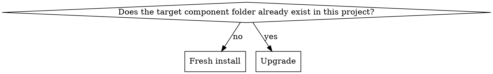

# Color Checker

## Overview

A floating, hover-driven dev tool: click to enter inspect mode, hover any element to see whether its background/text/border colors are token-backed or hardcoded, and a page-wide coverage scan flags every non-compliant element at once. A second mode ("Try a Colour") live-overrides a chosen token's CSS custom property so you can watch, in real time, which parts of the UI move with it and which don't — the fastest way to answer "does anything still hardcode this color."

Unlike `sync-tokens` (a pipeline that runs and finishes) or `slice-component` (edits that get committed), this skill's output is a **permanent runtime component** living in the target app — installing it is a one-time scaffold, but the reference implementation itself keeps evolving, and existing installs need a way to catch up.

## When to Use

- A project has a token pipeline (see `sync-tokens`) but no way to verify the *markup* actually uses it
- Debugging "why doesn't this element pick up the new token color" — drop this in and hover it
- The tool itself gained a feature (like Try a Colour) after a project already installed an older copy

**Not for:** generating the tokens in the first place (`sync-tokens`), or porting whole pages (`slice-component`).

## Install vs. upgrade

Check for the target folder (ask the user where components live, e.g. `src/components/colorChecker/`) before doing anything else.

### Fresh install

1. Copy every file under `reference/` verbatim into the target folder.
2. Wire the mount point: the top-level `<ColorChecker />` needs to render once near the app's root (ask where that is — an `App.js`/root layout component). Wrap it in whatever visibility gate the project wants (a settings toggle, an env check, or none — ask; the reference implementation gates it behind a Settings-page toggle plus a `ColorCheckerProvider` context, but that's not required).
3. Confirm the "semantic tier" prefix. The reference implementation treats any CSS custom property starting with `--theme-` as the highest-trust tier (drives the "Semantic" vs plain "Token" distinction in the audit). If this project's token pipeline uses a different prefix convention, that's a one-line change in `colorCheckerEngine.js`'s `auditProperty` — ask, don't assume `--theme-`.
4. Verify: open the app, click the floating button, hover a few elements, confirm the tooltip shows sensible results.

### Upgrade

1. Diff every file in `reference/` against what's already installed.
2. For each file that differs, show the user what changed and ask before overwriting — a project may have customized z-index values, added a project-specific check, or renamed something. Never blind-overwrite.
3. New files (a capability that didn't exist in the older install, like `TryColorPanel.js`) get added the same way a fresh install would add them, then wired into the existing `ColorChecker.js`'s render tree — read the current file's structure first; don't assume it matches the reference implementation's exact prop names if it's been modified.
4. Re-verify the same way as a fresh install.

## How the engine works (for context, not to re-derive)

`colorCheckerEngine.js` builds its token whitelist by reading every custom property declared under any `:root`-containing selector across the page's own stylesheets — **zero hardcoded token list**, it's always in sync with whatever the project's generated CSS currently contains. It resolves the winning CSS declaration for `color`/`background-color`/`border-color` per element (respecting cascade specificity and `!important`, not just `getComputedStyle`, since computed style can't distinguish "token-driven" from "hardcoded value that happens to render the same"), and classifies each as `semantic` / `token` / `hardcoded`.

The "Try a Colour" panel (`TryColorPanel.js`) separately lists every token currently resolving to a real color and lets you pick a new one per-token via a native color-swatch input — writing the override as an inline CSS custom property on `<html>`, so it beats any stylesheet without editing a file, and vanishes on reload.

## Common Mistakes

- **Blind-overwriting an existing install on upgrade.** Loses project-specific customizations silently — always diff and ask first.
- **Assuming `--theme-` is the right semantic prefix.** It's the reference implementation's convention, not a universal one — confirm against the actual project's token pipeline.
- **Keying a live-updating `<input type="color">` on its live value.** Forces a remount on every drag event inside the browser's own picker, which closes the picker popup mid-interaction. Key on an explicit "reset generation" counter that only changes on an intentional reset, never on a live pick.
- **Native `<input type="color">` not repainting after a programmatic reset.** Some browsers don't redraw the swatch on a plain `value` prop change from outside the input's own interaction — force a remount at that moment specifically (see the reset-generation pattern above), not on every render.
