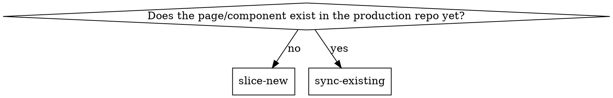

# Slice Component

## Overview

Two codebases exist: a **prototype repo** (design-synced, often mock data, may be TypeScript) and a **production repo** (real API/state, the actual shipping app). This skill moves a page's design from prototype → production, in one of two modes depending on whether the page already exists in production.

## Requires a prototype codebase — not just a Figma file

Both commands work by reading an existing *coded* implementation of the page and diffing or copying from it. **If the only source of truth is a Figma file, with no prototype repo at all, this skill does not apply yet** — there's nothing on disk to diff against or copy from.

That gap has to be closed by something else first: someone building the page from the Figma design (by hand, or with a Figma-to-code tool/MCP integration if one is available in your environment) into a prototype repo. Once that repo exists — even just for the one page in question — `slice-new`/`sync-existing` can take over from there. Don't try to stretch this skill into reading Figma directly; that's a fundamentally different job (interpreting a design file) from what it actually does (diffing two codebases).

## When to Use

- A page exists in the prototype's Figma-synced *source code*, redesigned, and needs to reach production
- A production page was already ported once, and the prototype's design changed since — apply only the delta
- **Not for:** wiring real API calls into an already-sliced page (a separate integration step); auditing token/design compliance without changing anything (see `color-checker` for the runtime audit half of that); building a page from a Figma file with no existing prototype code (see above).

## Which mode?

This is a filesystem check, not a judgment call — look for the target directory before asking the user anything.

## Setup: two placeholders every project fills in

Neither command hardcodes a prototype layout or a production layout. Before first use on a new pair of repos, confirm with the user (or read from a small project config if one exists):

- `{{PROTOTYPE_PAGES_DIR}}` — where the prototype's design-synced source lives (e.g. `src/pages-tsx/`)
- `{{PRODUCTION_PAGES_DIR}}` — where production pages land (e.g. `src/pages/v2/`)
- `{{MENU_REGISTRY_FILE}}` (optional) — a sidebar/nav config mapping human menu names to routes, if one exists. If the project has no such registry, skip straight to asking the user for the target page's path directly instead of trying to resolve a menu name.
- `{{ROUTES_FILE}}` (optional) — where routes map to page components, for resolving a route to its folder.
- `{{REDESIGN_SIGNAL}}` — see below.

## Command: `slice-new`

Page doesn't exist in production yet.

1. Resolve the target: if given a menu/human name and `{{MENU_REGISTRY_FILE}}` exists, grep it, then cross-reference `{{ROUTES_FILE}}` to get the real folder. If either file doesn't exist, or the name doesn't resolve, ask the user for the literal path directly — don't guess a folder name from a label (a page named "Asset Type" is not reliably `pages/asset-type`; it may be nested, aliased, or plural differently).
2. Copy the prototype's page wholesale into the production location.
3. Strip TypeScript if the prototype is `.tsx`/`.ts` and production is plain JS: remove type annotations, `interface`/`type` declarations, `import type`, `as Type` casts.
4. Fix import paths for production's aliasing convention.
5. Translate design tokens/color classes per the production app's own bridge (see the `sync-tokens` skill's `tokenMap` if this project uses that pipeline) — a prototype already synced to the same Figma tokens usually needs little to no color-class translation; a prototype still on an older/different palette needs real mapping.
6. Verify: lint, build, and whatever test command the project defines.

## Command: `sync-existing`

Page already exists in production, with real data-fetching hooks, state, and permission checks the prototype's mock version doesn't have.

1. **Confirm there's an actual delta first.** Check the prototype path was touched recently (git log) AND shows `{{REDESIGN_SIGNAL}}` — a marker that the prototype has been through the *same* design pass as other already-migrated pages. In the reference implementation this was "does this file use `+Theme`-shaped Tailwind classes (`bg-surface`, `border-invert-default`, etc.) rather than an older palette" — the exact signal is project-specific; a project not using that palette naming needs its own marker (a git tag, a comment convention, whatever distinguishes "redesigned" from "not yet"). No signal → nothing to sync, stop and say so.
2. **Read both files fully before editing either.** They've diverged for real reasons (production has hooks/permissions the prototype's mock version never had) — don't diff blindly by line number.
3. **Identify the structural delta by reading the JSX, not by pattern-matching from a template.** Common patterns worth checking for by name (confirmed as recurring across a real project, not guaranteed to be the only ones): a toolbar restructuring from a lone search box to a two-sided header+search row; a card wrapper's border/radius/background changing; a bulk-selection pattern moving from an inline per-row button to a floating action bar. But read the actual diff — don't assume the delta is one of these just because it was last time.
4. **Edit only the regions with a real delta.** Reuse the production file's *existing* state variables, hooks, and handlers in the new markup — never invent a new state variable or re-derive a count/total that's already computed. If the prototype's version needs data production doesn't currently fetch, that's a genuinely new feature, not a design sync — stop and report it rather than wiring up new data-fetching as a side effect.
5. **Never touch:** data-fetching hooks and their params, Redux/store selectors, permission checks, event-handler bodies (only their JSX call sites may move), route registration, service imports.
6. **Porting a shared presentational component the new design depends on** (e.g. a bulk-action-bar component neither repo's production side has yet) is in scope, *as long as* it's wired to the page's existing state/handlers and fetches no data of its own. The moment a new section needs data the page doesn't already have, that's out of scope — report it, don't build it.
7. Verify: lint immediately per file (cheap, catches mistakes early), then build + full test suite once across all pages touched in the batch. Compare before/after test counts — must be unchanged; a new failure means something in a structural edit broke, find and fix it before reporting success.

## Common Mistakes

- **Guessing a folder name from a menu label.** Nesting, pluralization, and abbreviation are inconsistent across most codebases — always resolve via the actual registry/routes files or ask.
- **Applying `slice-new`'s "just copy" logic to an existing page.** Overwrites real integration work with the prototype's mock data — a regression, not an update.
- **Inventing a new count/state variable instead of reusing the existing one.** If the page already computes `totalItems` from its data hook, the new header markup uses that — never a fresh `useState` for something already derived.
- **Treating "the reference file changed" as sufficient signal to sync.** A prototype file with unrelated changes (a typo fix, a bug fix unrelated to design) isn't a design delta — check for the actual redesign signal, not just recent git activity.
